

# EFRAIM JOÃO MANUEL BERNARDO

### `Web Developer Junior`

  Build to innovate, Program to Build!

---

## 👨‍💻 About me

Hey! My name is **Efraim Bernardo**, and I'm a **Junior Web Developer**.

Welcome to my digital space.

I'm passionate about building clean, responsive and user-friendly websites. My journey into web development began with curiosity and has grown into a strong commitment to learning, creating and solving real-world problems through technology.

I work mainly with **HTML, CSS, JavaScript, Node.js, PostgreSQL and React.js**, while continuously expanding my knowledge in full-stack development.

This GitHub profile reflects my academic journey, personal projects and the skills I've been developing.

I believe code isn't only about functionality — it's also about creating useful experiences.

Whether it's a landing page, management system, portfolio, API or complete web application, my goal is to build solutions that are meaningful, functional and effective.

---

# 🛠️ Tech Stack

### Frontend

### Backend

### Database

### Tools

 

---

# 🚀 Projects

<table>

<tr>

<td width="50%" valign="top">

### 🔐 ARS

**Anonymous Reporting System**

A system designed to allow anonymous reporting while protecting the identity of users.

</td>

<td width="50%" valign="top">

### 🔎 LFMS

**Lost & Found Management System**

A system designed to organize and manage lost and found items.

</td>

</tr>

<tr>

<td width="50%" valign="top">

### 🖼️ Images Downloader

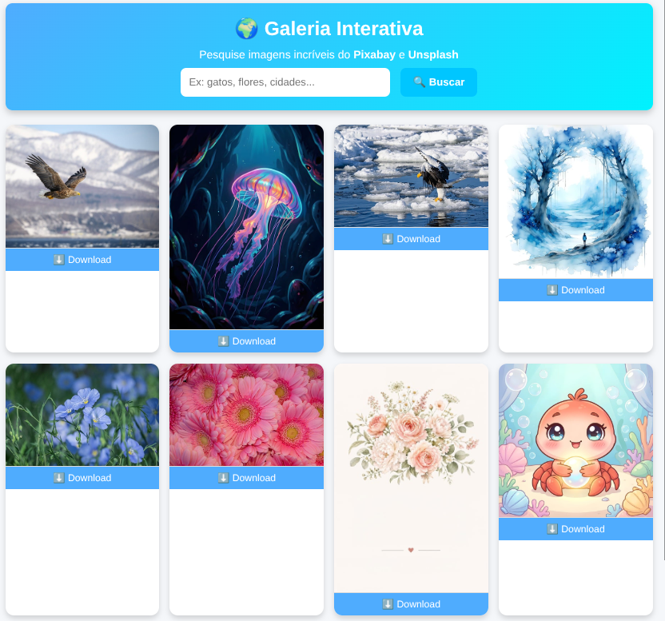

Web application for searching and downloading images using external image APIs.

</td>

<td width="50%" valign="top">

### 📦 SISTOCKE

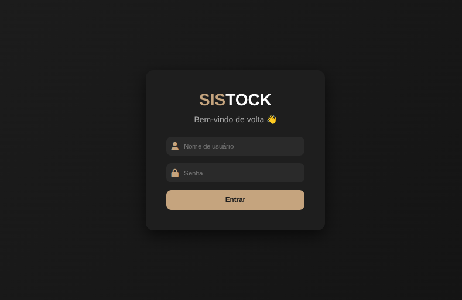

Stock management system created to manage products and inventory.

</td>

</tr>

<tr>

<td width="50%" valign="top">

### 👤 User Cadastre

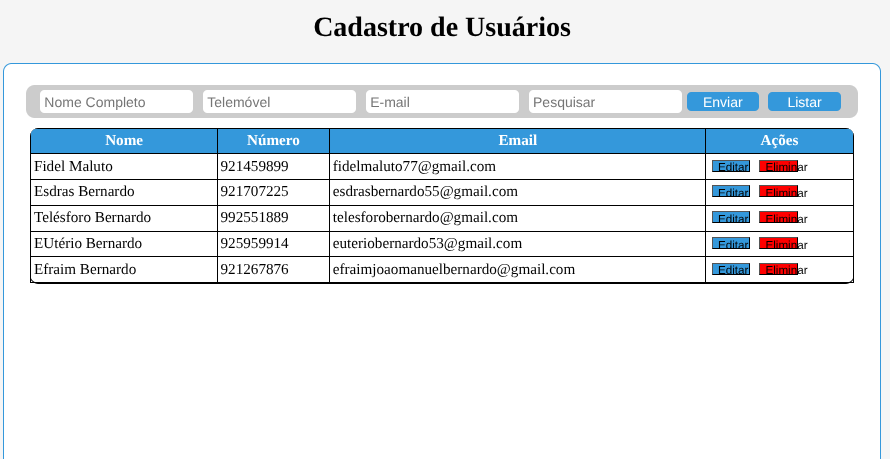

User registration and management application.

</td>

<td width="50%" valign="top">

### 📇 Contact List

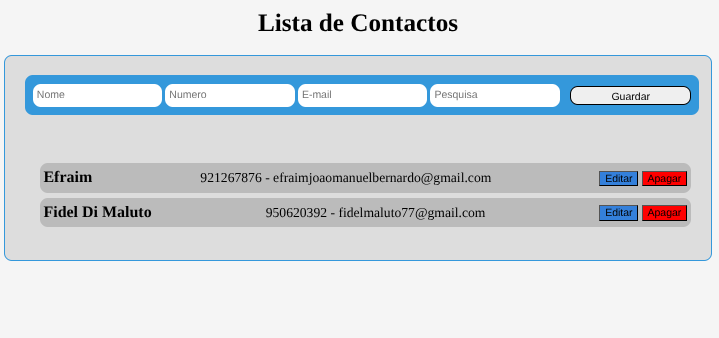

Application for registering and managing contacts.

</td>

</tr>

<tr>

<td width="50%" valign="top">

### 🎓 New Student Selection System

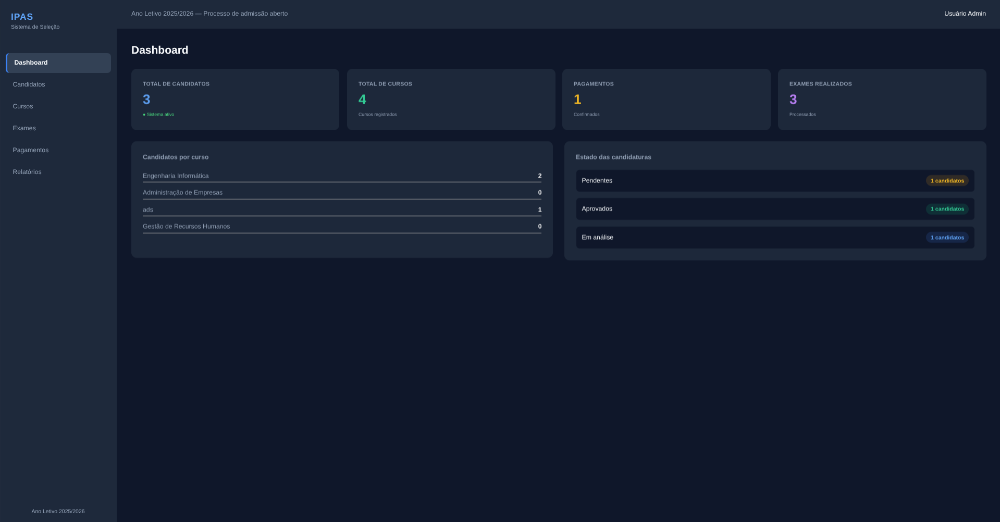

System created to help educational institutions manage the selection of new students.

</td>

<td width="50%" valign="top">

### 💳 SkyBank

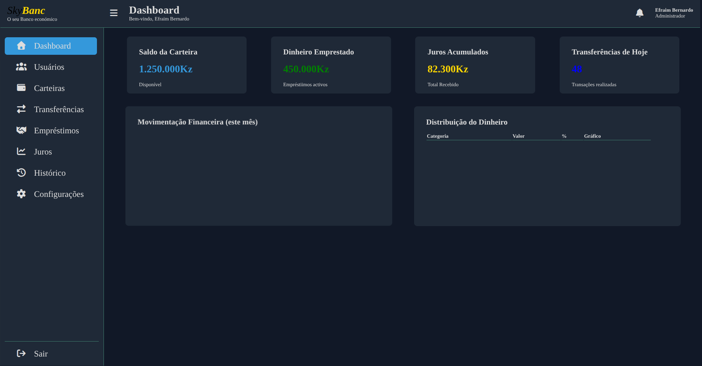

Digital wallet and economy project focused on financial operations and money management.

</td>

</tr>

<tr>

<td width="50%" valign="top">

### 🍰 Lissandra Confectionery

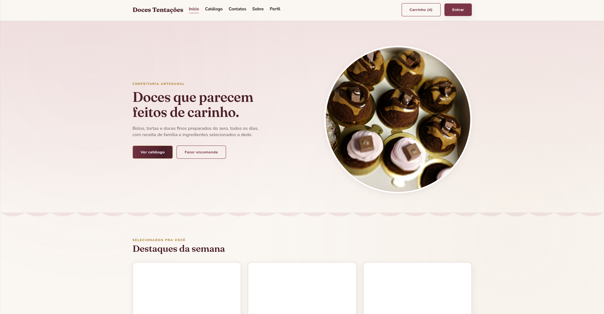

Web application for **Lissandra Doces Tentações**.

</td>

<td width="50%" valign="top">

### 👥 Employees

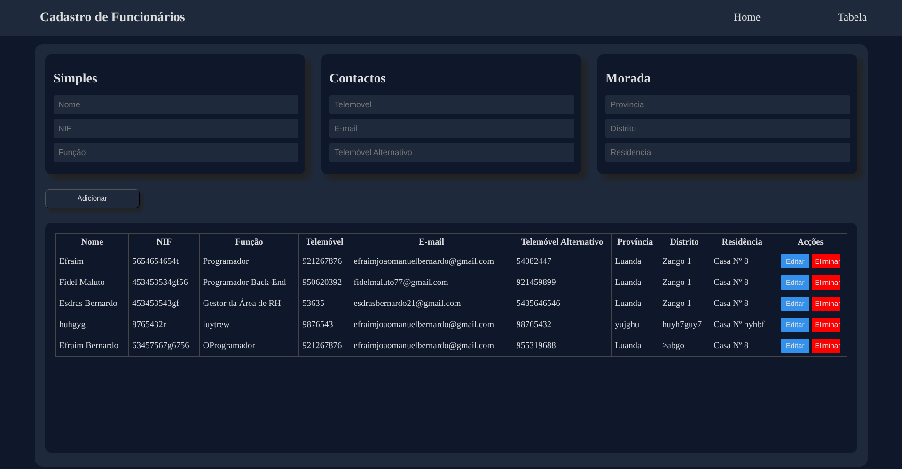

Employee management system.

</td>

</tr>

<tr>

<td width="50%" valign="top">

### 💬 FEST Chat

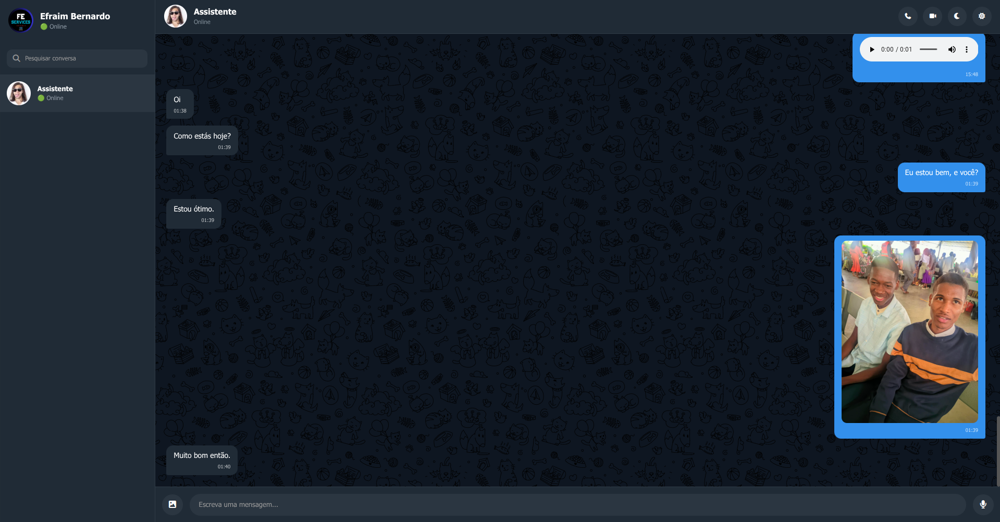

Real-time communication application.

</td>

<td width="50%" valign="top">

### 🛒 NewLys | E-Commerce

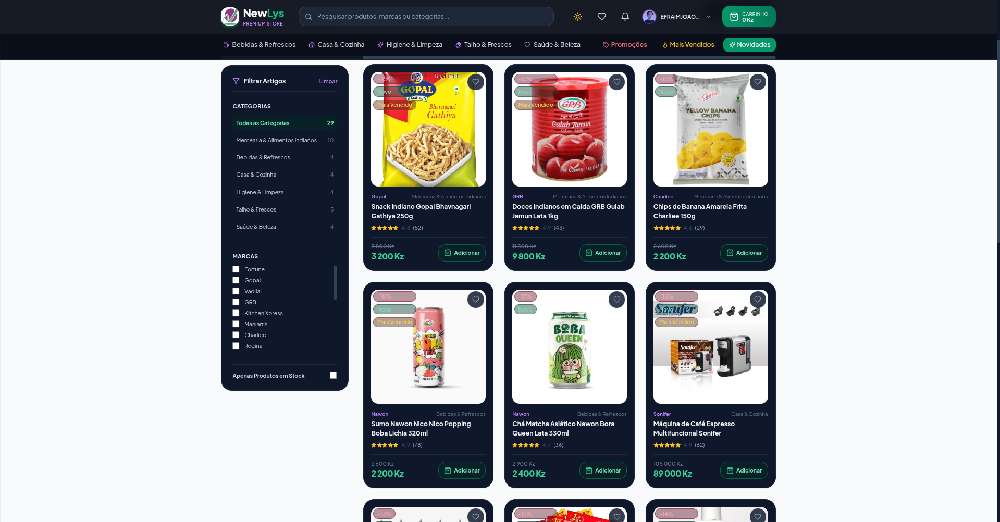

E-commerce interface developed for the NewLys project.

</td>

</tr>

</table>

---

# 📊 GitHub Stats


---

# 📈 Activity

<h2 align="center">📊 Activities</h2>

  

---

# 🌐 Connect With Me

---

### `BUILD TO INNOVATE`

### `PROGRAM TO BUILD!`

